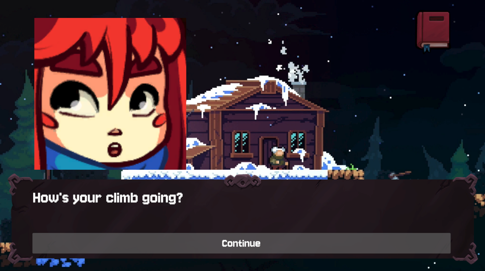
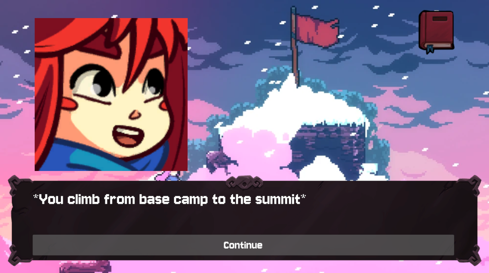

# Voiceflow GameFlow: LLM powered Unity Game
A Unity game integrating [Voiceflow](https://www.voiceflow.com/?utm_source=github&utm_medium=organic&utm_campaign=developer&utm_content=unity-chat-github) as a custom interface with an LMM powered NPC, that not only can have organic conversatoins, but through agent design can also interract with the game world, by giving or receiving items, changing the game scene, or pulling from a knowledge base of lore.

Demo video: https://youtu.be/-_grpoO6AJ0

Full project walkthrough: https://youtu.be/KISOxSOAZWs

All the graphics for the game are from [Celeste](https://www.celestegame.com/).

Demo video: 

Full design walkthrough:

## Feature overview
- LLM driven conversations with persistent memory and awareness of the game world's situation, as a handcrafted AI agent built on Voiceflow.
- Voice synthesis using ElevenLabs, run from inside of Voiceflow and playing in Unity.
- An inventory system that can be used to give or receive items from the NPC that affect the conversation.
- A scene change system that can be used to change the background as you climb the mountain.
- Lore based dialogue with documents pulled from a knowledge base in Voiceflow.

## How to set up

*Note: This project uses a lot of AI tokens on your Voiceflow account (~10k per minute of conversation), so be careful with your usage. Consider using cheaper LLMs from inside Voiceflow. You'll also need a paid ElevenLabs account, or you could get weird 401s.*

1. Clone the repository
2. Import `Unity_Chat.vf` into your [Voiceflow](https://www.voiceflow.com/?utm_source=github&utm_medium=organic&utm_campaign=developer&utm_content=unity-chat-github) workspace. Depending on your plan, you might have to change the LLM used in certain steps.
3. From [Voiceflow](https://www.voiceflow.com/?utm_source=github&utm_medium=organic&utm_campaign=developer&utm_content=unity-chat-github), set the `ElevenLabsAPIKey` to your ElevenLabs API key, publish the project, and fetch the `VoiceflowAPIKey` from the [project settings](https://developer.voiceflow.com/v2.0/reference/project).
4. Open the project in Unity (the project is made in 2022.3.30f1) and set the `VoiceflowAPIKey` in the `VoiceflowController` script.
5. Run the project and start the conversation!

